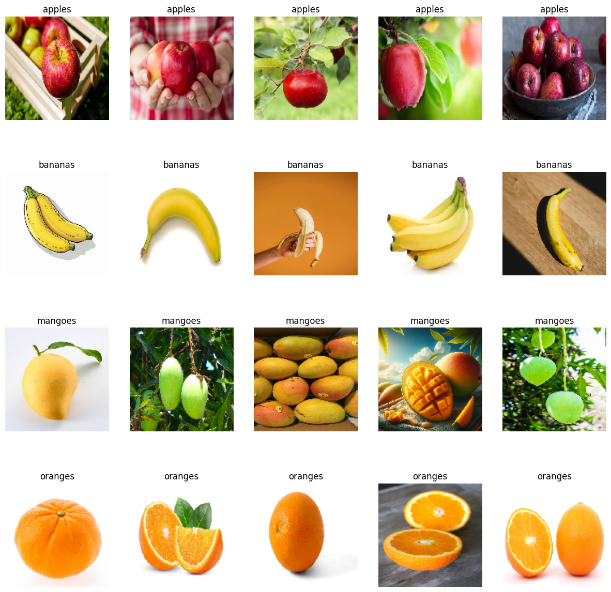
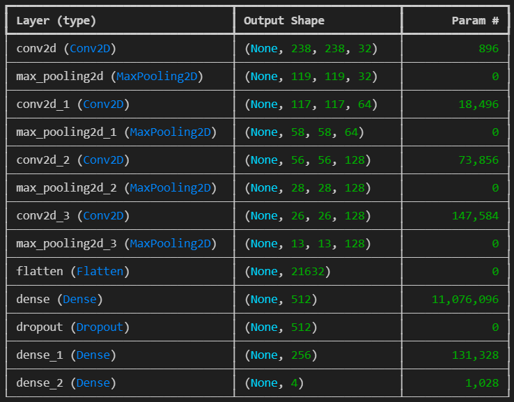
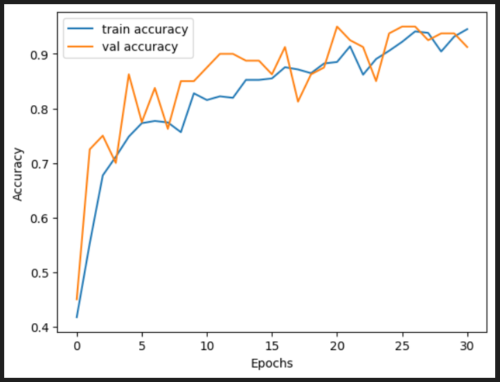
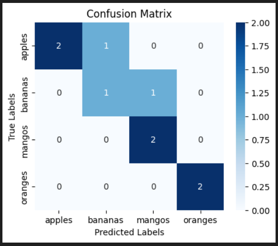
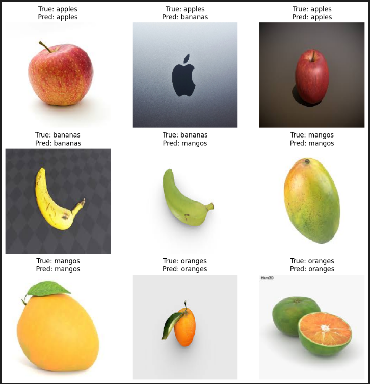

# Fruit Classification
## Description
Fruit Classification was done using the implementation of CNNs. The model was trained on a dataset devided into 4 classes as given in the following.
- Apples
- Bananas
- Mangoes
- Oranges

This project was an example usage of CNNs and how can thesse be used to classify objects. 

## Project Implementation
There were a set of requirements for the completion of this project, as elaborated in the following.

### Dataset Collection
A data set of around ``800 images`` was collected that included nearly 200 images for each of the classes. A look of it is given in the following.

### Model Training
In this section an ImageDataGenerator was used to firstly preprocess the data, followed by the test and validation split at ``90 - 10 ratio`` 

Afterwards a Sequential Model was generated with the model summary as in the following.

Afterwards the model was trained through 40 epochs but was stopped at 31 because of the use of ``early stopping`` 

### Model Testing
After the training the model was validated and it gave a validation accuracy of ``90%`` as given in the following.

In the end it was tested over a testing data that was never given to the model and the accuracy was pretty amazing. In the following is the confusion matrix of the testing set.

And finally the results for all the ``9 samples`` of the testing set. 

## Final Word
Now in the conclusion, it is to be put forward that it is not the best of the models but it is a really ``great POC`` The CNNs are really powerful techniques but they surely are limited by the extent of the dataset. If only the dataset included some samples of logo of Apple Inc. it would've been mable to distinguish that as well and same goes for green Banana as there were no instance of that in the data as well.

---